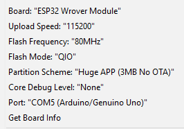
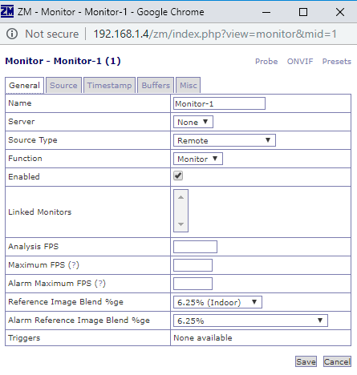
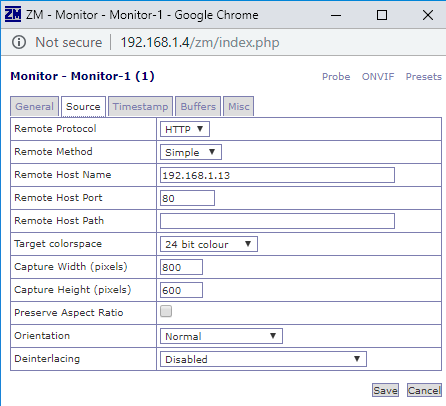

# Hardware notes for ESP32 with camera

Install ESP32 board module

Arduino IDE -> File -> Preferences -> Add the following to "Additional Board Manager URLs"

https://dl.espressif.com/dl/package_esp32_index.json

Tools -> Boards -> Board Manager...

Search for "ESP32" and add board from Espressif Systems

Check antenna is on board not to external connector [Link](https://robotzero.one/esp32-cam-arduino-ide/)

Arduino IDE settings

Code used for initial test: [Micro-RTSP](https://github.com/geeksville/Micro-RTSP)

* Edit 'ESP32-devcam.ino' to use 'esp32cam_aithinker_config' in cam.init() call

* Comment out ENABLE_OLED 

* Planning to rewrite so it doesn't use Strings library

Settings for Zoneminder

Install on Raspi Pi from [Wiki](https://wiki.zoneminder.com/Raspbian#How_to_install_ZoneMinder_1.32.2_on_Raspberry_PI_3_with_Raspbian_9_.28Stretch.29)

 

