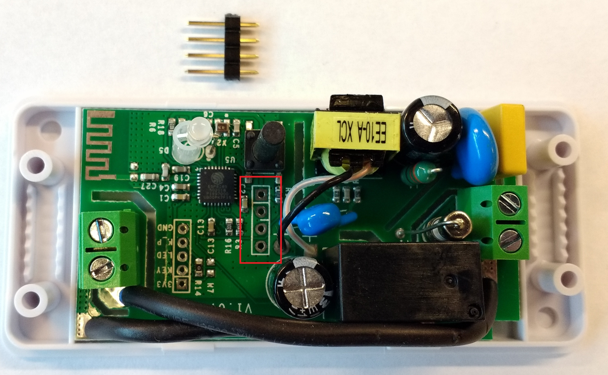

# Hardware notes for Sonoff Basic

## Hacking Sonoff Basic

To program the Sonoff Basic, you will need to solder a 4 pin header to the board (note: docs online sometimes reference a 5 pin header for older versions of the Sonoff, this applies to those as well).

1. Open the Sonoff case and locate the header solder points and insert the header.

   

2. Put a piece of tape across the top of the header to hold it in place

   
   
3. Flip the sonoff over and solder the 4 leads. Note the markings for 3v3 (power), GND, Rx, and Tx for hooking up later.

   
   
## Programming via Arduino IDE

More text later, but here's the IDE settings I used to program the onboard chip.

