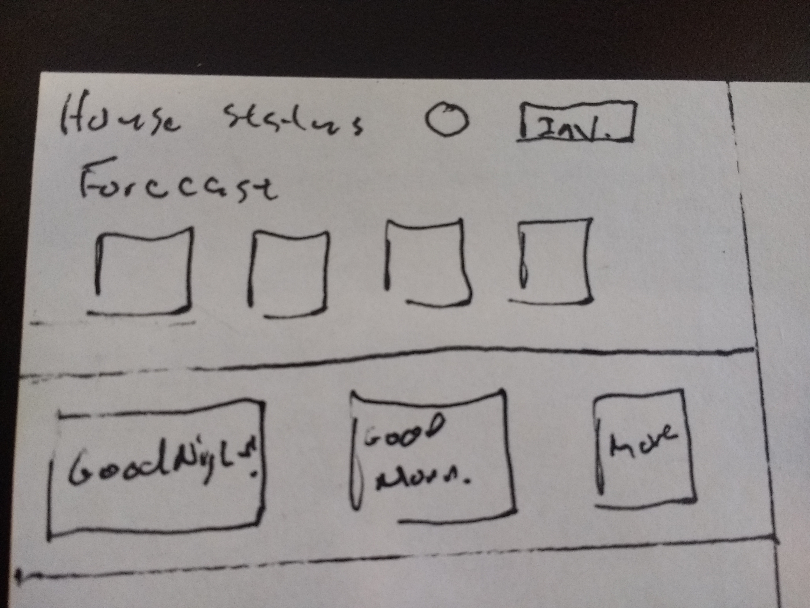

# Bed side display/control

## Purpose

I envision this GUI to be a simple device with 2 or 3 function buttons. At night, I hit go to bed and it triggers various IoT devices to shut off or turn on. I would also like it to display some status stuff like are my doors locked or what is the temperature outside and maybe a short forecast.

## Hardware

* Rasperry Pi B+

* [3.5" TFT Display](https://www.adafruit.com/product/2097)

